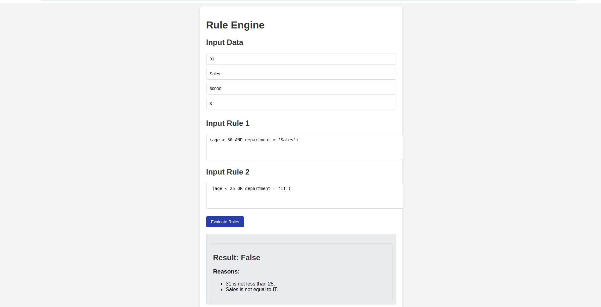
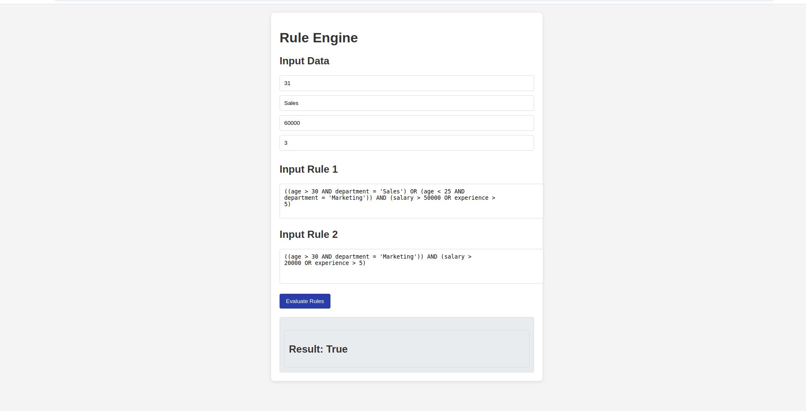

# Rule Engine with AST (frontend)
## Overview
This React application serves as the frontend for the Rule Engine, allowing users to input eligibility rules and user attributes. It interacts with a backend API to evaluate the rules and display results.

## Features
- Input user attributes (age, department, salary, experience).
- Input two conditional rules in a user-friendly interface.
- Evaluate rules against provided user data with clear result display.
- Show detailed reasons for evaluation failures.

## Usage
- `Input Data:` Enter user attributes in the input fields (age, department, salary, experience).
- `Input Rules:` Enter two rules in the provided 
- `text areas.` Example formats:
    - Rule 1: (age > 30 AND department = 'Sales')
    - Rule 2: (age < 25 OR department = 'IT')
- `Evaluate Rules:` Click the "Evaluate Rules" button to send data and rules to the backend.
- `View Results:` The application displays whether the rules evaluate to true or false, along with reasons for any failures.
## Screenshot
- if rules doesnt satisfies

- if rules satisfies

## API Interaction
- The application sends a POST request to the backend endpoint at http://localhost:5000/evaluate with the following structure:
```json
{
  "rules": ["rule1_string", "rule2_string"],
  "data": {
    "age": 30,
    "department": "Sales",
    "salary": 50000,
    "experience": 5
  }
}

```
## Components

- `Input Section:` For entering user attributes and rules.
- `Output Section:` Displays evaluation results and reasons.

## Installation
1. **Clone the Repository**
   ```bash
   git clone <repository-url>
   cd <repository-directory>
   ```
2. **Install Dependencies Navigate to the project directory and run:**
    ```bash
    npm install
    ```
3. **Start the Development Server Start the React application:**
    ```bash
    npm start
    ```
|  Make sure your Node.js server is running on http://localhost:5000.

